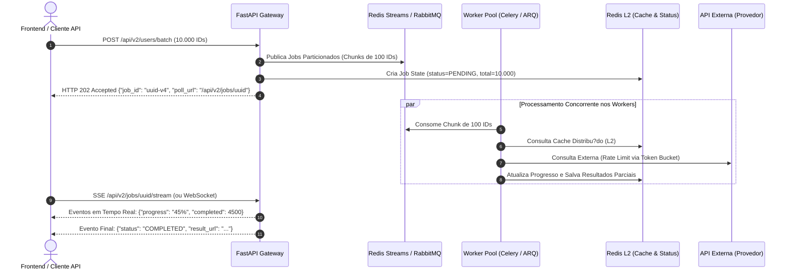

# 05. ROADMAP DE ESCALABILIDADE: ALTA VOLUMETRIA E PROCESSAMENTO DISTRIBU?DO

Este documento projeta a evolu??o arquitetural do **Hit Digital - Async User Batch Fetcher** para cen?rios de alta volumetria enterprise, onde a demanda escala de dezenas para centenas de milhares de requisi??es simult?neas ($10^4$ a $10^6$ IDs por lote).

---

## 1. Limita??es do Modelo S?ncrono Tradicional

O modelo s?ncrono atual (`POST /api/users/fetch` mantendo a conex?o HTTP aberta at? o t?rmino do processamento) ? ideal para lotes de at? 100 itens ($\leq 2$ segundos de lat?ncia). No entanto, submeter lotes de 10.000 ou 100.000 IDs a uma ?nica requisi??o HTTP s?ncrona causa colapsos inevit?veis:
1. **HTTP Gateway Timeouts:** Proxies reversos corporativos (Cloudflare, Nginx, AWS ALB) derrubam conex?es HTTP abertas que excedem 30 a 60 segundos com `HTTP 504 Gateway Timeout`.
2. **Head-of-Line Blocking de Conex?es:** Clientes HTTP e navegadores mant?m sockets presos, consumindo pools de conex?o e portas ef?meras.
3. **Falta de Idempot?ncia e Perda de Estado:** Se a conex?o de rede cair no segundo 45 de um lote de 10.000 IDs, o cliente n?o recebe os dados j? processados e ? for?ado a reprocessar tudo do zero.

---

## 2. Transi??o para Arquitetura Orientada a Eventos (Asynchronous Job Pattern)

Para escalar horizontalmente sem risco de timeouts, o sistema migra para o padr?o **Asynchronous Job Worker** (RFC 7240):



### 2.1 Contrato da API V2 (HTTP 202 Accepted)

#### 1. Ingest?o do Lote: `POST /api/v2/users/batch`
```json
// Requisi??o:
{
  "user_ids": [1, 2, 3, ..., 10000],
  "webhook_url": "https://client.com/webhooks/batch-completed" // Opcional
}

// Resposta Imediata: HTTP 202 Accepted
{
  "job_id": "b3e945c7-1234-4b5a-8e2b-f4581290aa31",
  "status": "QUEUED",
  "total_ids": 10000,
  "chunks_count": 100,
  "created_at": "2026-09-18T12:00:00Z",
  "links": {
    "status_url": "/api/v2/jobs/b3e945c7-1234-4b5a-8e2b-f4581290aa31",
    "stream_url": "/api/v2/jobs/b3e945c7-1234-4b5a-8e2b-f4581290aa31/stream",
    "cancel_url": "/api/v2/jobs/b3e945c7-1234-4b5a-8e2b-f4581290aa31/cancel"
  }
}
```

#### 2. Consulta de Status / Polling: `GET /api/v2/jobs/{job_id}`
```json
// Resposta: HTTP 200 OK
{
  "job_id": "b3e945c7-1234-4b5a-8e2b-f4581290aa31",
  "status": "PROCESSING",
  "progress_percentage": 78.4,
  "metrics": {
    "total": 10000,
    "processed": 7840,
    "successful": 7600,
    "failed": 240,
    "cache_hits": 3100
  },
  "estimated_time_remaining_seconds": 4.2
}
```

---

## 3. Fila de Mensagens e Particionamento em Chunks (*Batch Chunking*)

### 3.1 Orquestra??o com Redis Streams / RabbitMQ e Workers ARQ/Celery
O monolito s?ncrono ? decomposto em um conjunto distribu?do de workers ass?ncronos stateless em cont?ineres Docker/K8s gerenciados pelo **ARQ** (framework ass?ncrono moderno para Python baseado em Redis) ou **Celery**:

```python
# Estrat?gia de Particionamento (Chunking Strategy) no Gateway
CHUNK_SIZE = 100

def partition_batch(user_ids: List[int], chunk_size: int = CHUNK_SIZE) -> List[List[int]]:
    for i in range(0, len(user_ids), chunk_size):
        yield user_ids[i:i + chunk_size]

# Ao receber 10.000 IDs:
chunks = list(partition_batch(request.user_ids, 100))
# Dispara 100 tarefas ass?ncronas independentes na fila
for chunk_idx, chunk in enumerate(chunks):
    await queue.enqueue_task(
        "process_user_chunk",
        job_id=job_id,
        chunk_index=chunk_idx,
        user_ids=chunk,
    )
```

### 3.2 Vantagens do Particionamento em Lotes (Chunks)
1. **Concorr?ncia El?stica Horizontal:** Se o cluster tiver 10 pods de workers, os 100 chunks s?o distribu?dos uniformemente. Se a carga aumentar, o HPA (Horizontal Pod Autoscaler) do Kubernetes eleva os pods para 50, concluindo o trabalho na fra??o do tempo.
2. **Isolamento de Quebra de Worker (Fault Tolerance):** Se um pod sofrer um crash de hardware no chunk 37, o broker de mensagens detecta o n?o-envio do `ACK` e reencaminha apenas aquele chunk espec?fico para outro worker sadio, sem reiniciar o lote inteiro.

---

## 4. Rate Limiting Distribu?do (Algoritmo Token Bucket em Redis)

Em um ambiente distribu?do com m?ltiplos workers consultando a mesma API externa, sem?foros locais em mem?ria de processo (`asyncio.Semaphore`) tornam-se insuficientes. Se 10 workers possu?rem sem?foros locais de 10, a concorr?ncia global sobre o provedor remoto atingir? 100 chamadas simult?neas, violando o SLA e causando `HTTP 429`.

### 4.1 Implementa??o Centralizada via Script Lua At?mico no Redis
Para garantir consist?ncia sem overhead de rede, o algoritmo **Token Bucket** ? executado de forma at?mica no Redis:

```text
Capacidade M?xima: 100 tokens (Burst Capacity)
Taxa de Reabastecimento: 20 tokens / segundo (Replenishment Rate)

    +-------------------------------------------------+
    |        Redis Token Bucket (Chave: ratelimit:api)|
    |                                                 |
    |   Tokens Atuais = min(Capacidade, Tokens + Delta)|
    +-------------------------------------------------+
           |                                   |
    [Worker 1: Consome 1]               [Worker N: Consome 1]
    (Se tokens >= 1 -> Prossegue)      (Se tokens == 0 -> Espera)
```

```lua
-- Script Lua At?mico para Token Bucket no Redis
local key = KEYS[1]
local limit = tonumber(ARGV[1])
local current_time = tonumber(ARGV[2])
local refill_rate = tonumber(ARGV[3]) -- tokens por segundo

local data = redis.call("HMGET", key, "tokens", "last_updated")
local tokens = tonumber(data[1])
local last_updated = tonumber(data[2])

if tokens == nil then
    tokens = limit
    last_updated = current_time
else
    local elapsed = math.max(0, current_time - last_updated)
    tokens = math.min(limit, tokens + (elapsed * refill_rate))
    last_updated = current_time
end

if tokens >= 1 then
    tokens = tokens - 1
    redis.call("HMSET", key, "tokens", tokens, "last_updated", last_updated)
    redis.call("EXPIRE", key, 60)
    return 1 -- Permitido
else
    redis.call("HMSET", key, "tokens", tokens, "last_updated", last_updated)
    return 0 -- Bloqueado (Excedeu Rate Limit)
end
```

---

## 5. Comunica??o Reativa em Tempo Real: Server-Sent Events (SSE)

Para evitar que o cliente realize *polling agressivo* (`while true: GET /api/v2/jobs/{job_id}`) gerando tr?fego desnecess?rio na infraestrutura, a arquitetura utiliza **Server-Sent Events (SSE)** via protocolo HTTP/2:

### 5.1 Endpoint de Streaming (`GET /api/v2/jobs/{job_id}/stream`)
- O cliente abre uma ?nica conex?o unidirecional leve.
- Conforme os workers processam os chunks, eles publicam eventos de progresso no canal Redis Pub/Sub `job:events:{job_id}`.
- O endpoint SSE consome do Redis e envia frames para o navegador em tempo real:

```text
event: progress
data: {"job_id": "b3e945c7", "percent": 25.0, "processed": 2500, "total": 10000}

event: progress
data: {"job_id": "b3e945c7", "percent": 75.0, "processed": 7500, "total": 10000}

event: completed
data: {"job_id": "b3e945c7", "percent": 100.0, "download_url": "/api/v2/jobs/b3e945c7/download"}
```

---

## 6. Estrat?gia de Cache Multin?vel (L1 Local + L2 Distribu?do)

Para aliar a lat?ncia de nanossegundos da mem?ria local com a consist?ncia global distribu?da, adota-se a topologia **Multi-Level Cache**:

```text
[Requisi??o de ID]
       |
       v
  [Cache L1 Local (Process Memory)] ---------> HIT? -> Retorna (< 0.1ms)
       | (MISS)
       v
  [Cache L2 Distribu?do (Redis Cluster)] ----> HIT? -> Salva no L1 e Retorna (< 1.5ms)
       | (MISS)
       v
  [Chamada Externa HTTP (JSONPlaceholder)] --> Sucesso? -> Salva no L2 e L1 (~50ms)
```

### 6.1 Preven??o de Cache Stampede (Probabilistic Early Expiration - XFetch)
Quando uma chave muito popular expira em um sistema com milhares de requisi??es por segundo, centenas de workers podem disparar chamadas simult?neas ? API externa para recalcular o mesmo dado (*Cache Stampede*).
O sistema implementa o algoritmo probabil?stico **XFetch**:
$$ReadExternal = -\beta \times \delta \times \ln(rand()) > (TTL - CurrentTime)$$
Onde um worker aleat?rio recalcula a chave antecipadamente de forma transparente enquanto o cache antigo ainda ? v?lido, mantendo a chave permanentemente aquecida sem concorr?ncia destrutiva.

---

## 7. Tratamento de Falhas Irrecuper?veis: Dead-Letter Queues (DLQ)

Quando um ID de usu?rio esgota todas as pol?ticas de retry e backoff (ex.: falha persistente de rede, payloads corrompidos no provedor externo):
1. **Encaminhamento para DLQ (`users:dlq`):** Em vez de ser descartado silenciosamente, o evento completo de falha ? publicado em uma Dead-Letter Queue no RabbitMQ/Redis.
2. **Inspe??o e Auditoria:** Engenheiros de confiabilidade (SRE) possuem um dashboard administrativo para inspecionar os erros gravados na DLQ.
3. **Reprocessamento Sob Demanda (Replay Capability):** Ap?s a resolu??o da instabilidade do provedor externo, um comando disparador (`POST /api/v2/dlq/replay`) reejeta as mensagens com falha de volta na fila principal de processamento de forma cir?rgica.
