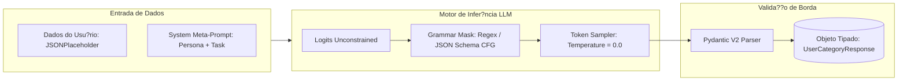
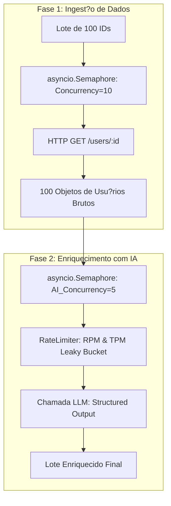

# 06. IA APLICADA EM PRODU??O E PADR?ES AVAN?ADOS DE ENGENHARIA DE PROMPTS

Este documento especifica os padr?es de arquitetura de software e engenharia de intelig?ncia artificial necess?rios para integrar modelos de linguagem de grande porte (LLMs) ao pipeline de processamento de usu?rios do **Hit Digital - Async User Batch Fetcher**.

---

## 1. O Desafio do N?o-Determinismo em Sistemas Transacionais

Sistemas corporativos exigem invariantes estritas: tipos de dados previs?veis, campos obrigat?rios preenchidos e garantias formais de contrato JSON. Por outro lado, LLMs (como GPT-4o, Claude 3.5 Sonnet ou Gemini 1.5 Pro) s?o motores probabil?sticos auto-regressivos que amostram o pr?ximo token com base em distribui??es de probabilidade condicionais:

$$P(w_t \mid w_1, w_2, \dots, w_{t-1})$$

A tentativa ing?nua de instruir o modelo via prompt livre ("*Por favor, responda apenas em formato JSON v?lido com os campos X e Y*") falha catastroficamente em produ??o devido a:
1. **Alucina??es de Sintaxe:** Inclus?o de blocos Markdown (```json ... ```), texto introdut?rio conversational ("Aqui est? o seu JSON:") ou v?rgulas extras (*trailing commas*).
2. **Deriva de Schema (Schema Drift):** Omiss?o de campos obrigat?rios, renomea??o de chaves (ex.: `user_id` virando `userId` ou `id`) e tipos incorretos (inteiro vindo como string).
3. **Inje??o Indireta de Prompt:** Dados n?o sanitizados do usu?rio contendo comandos maliciosos que subvertem as instru??es do sistema.

---

## 2. Structured Outputs: Amostragem Restrita por Gram?tica (CFG)

Para transformar a LLM em um componente transacional determin?stico, o sistema adota o paradigma de **Structured Outputs** nativo com esquemas Pydantic.



### 2.1 Mecanismo de Funcionamento: Como o Modelo ? For?ado a N?o Errar
Diferente de filtros p?s-gera??o, ferramentas modernas como **OpenAI Structured Outputs**, **Instructor** e **Outlines** atuam diretamente no momento em que os *logits* (distribui??o bruta de probabilidades de tokens) s?o calculados pela rede neural:
1. O schema Pydantic ? compilado em uma **Gram?tica Livre de Contexto (Context-Free Grammar - CFG)** ou em um Aut?mato Finito Determin?stico (DFA).
2. A cada passo de amostragem de token, uma m?scara booleana ? aplicada sobre o vocabul?rio da LLM:
   - Tokens que violariam a sintaxe JSON ou as chaves do schema recebem probabilidade zero ($-\infty$).
   - Apenas tokens v?lidos de acordo com o estado atual da gram?tica permanecem com probabilidade eleg?vel.
3. **Resultado Matem?tico:** ? matematicamente imposs?vel para o modelo emitir um JSON sintaticamente inv?lido ou um campo inexistente.

### 2.2 Exemplo de Implementa??o com Pydantic e Instructor

```python
from typing import List, Literal
from pydantic import BaseModel, Field
import instructor
from openai import AsyncOpenAI

# 1. Defini??o do Contrato Estrito de Sa?da da IA
class UserBusinessClassification(BaseModel):
    user_id: int = Field(..., description="ID do usu?rio analisado")
    market_segment: Literal["B2B Enterprise", "SMB", "B2C Consumer", "Gov / Education"] = Field(
        ..., description="Segmento de mercado deduzido a partir da empresa e dom?nio de e-mail"
    )
    engagement_priority: Literal["HIGH", "MEDIUM", "LOW"] = Field(
        ..., description="Prioridade de contato comercial"
    )
    risk_score: float = Field(
        ..., ge=0.0, le=1.0, description="Score de risco de fraude de 0.0 a 1.0"
    )
    reasoning_summary: str = Field(
        ..., max_length=200, description="Justificativa concisa da classifica??o"
    )

# 2. Cliente com Patch do Instructor para Inje??o de CFG
ai_client = instructor.from_openai(AsyncOpenAI())

async def classify_user_with_ai(user_data: dict) -> UserBusinessClassification:
    return await ai_client.chat.completions.create(
        model="gpt-4o-mini",
        response_model=UserBusinessClassification,
        temperature=0.0, # Determinismo m?ximo
        messages=[
            {
                "role": "system",
                "content": (
                    "Voc? ? um classificador especialista de dados cadastrais da Hit Digital. "
                    "Analise os dados fornecidos e produza a classifica??o categ?rica estrita."
                ),
            },
            {
                "role": "user",
                "content": f"Dados do Usu?rio: {user_data}",
            },
        ],
    )
```

---

## 3. Arquitetura de Resili?ncia para LLMs em Produ??o

### 3.1 Loop de Autocorre??o em Tempo de Execu??o (Self-Correction / Reflection Loop)
Mesmo com restri??es gramaticais, valida??es sem?nticas profundas (ex.: valida??es cruzadas com `@model_validator`) podem falhar em tempo de execu??o. Em vez de abortar o fluxo, implementa-se um loop de reflex?o autom?tica com limite m?ximo de retentativas:

```text
[Chamada ? LLM] 
       |
       v
[Valida??o Pydantic V2]
       |
       +---> V?lido? ------> [Retorna Modelo Tipado]
       |
       v (Inv?lido - ValidationError)
[Injeta Mensagem no Turno Seguinte]:
"O JSON anterior falhou na valida??o de regras de neg?cio com o seguinte erro:
{e.errors()}. Corrija os valores preservando os tipos."
       |
       v
[Segunda Chamada ? LLM com Contexto do Erro (Attempt 2/3)]
```

```python
async def resilient_llm_execution(user_data: dict, max_retries: int = 2) -> UserBusinessClassification:
    messages = [
        {"role": "system", "content": "Classificador cadastral corporativo."},
        {"role": "user", "content": f"Dados: {user_data}"}
    ]
    
    for attempt in range(max_retries + 1):
        try:
            response = await ai_client.chat.completions.create(
                model="gpt-4o-mini",
                response_model=UserBusinessClassification,
                temperature=0.0,
                messages=messages,
            )
            return response
        except Exception as exc:
            if attempt == max_retries:
                # Fallback de emerg?ncia (Heur?stica sem IA)
                logger.error("llm_classification_exhausted_fallback", error=str(exc))
                return fallback_heuristic_classifier(user_data)
            
            # Adiciona o erro ao hist?rico da conversa para autocorre??o
            messages.append({"role": "assistant", "content": "{"error": "failed_validation"}"})
            messages.append({"role": "user", "content": f"Erro de valida??o: {str(exc)}. Corrija o payload."})
```

### 3.2 Estrat?gia de Fallback Gracioso com Modelos Locais (SLMs)
Se a API do provedor de IA (OpenAI/Anthropic) sofrer uma indisponibilidade global (`HTTP 503 Service Unavailable` ou Rate Limits persistentes):
1. **Fallback L1 (Parser Tolerante):** Utiliza??o da biblioteca `json-repair` para sanitizar sa?das corrompidas de modelos mais r?pidos.
2. **Fallback L2 (Roteamento para SLM Local):** Comuta??o autom?tica de tr?fego para um modelo local menor (Small Language Model - ex.: Llama-3-8B ou Mistral-7B via vLLM ou Ollama local) hospedado em infraestrutura pr?pria da Hit Digital.
3. **Fallback L3 (Heur?stica Determin?stica):** Classifica??o baseada em regras est?ticas (Regex no dom?nio do e-mail: `.edu` $\rightarrow$ Gov/Education, `.com` $\rightarrow$ B2B Enterprise).

---

## 4. Pipeline de Enriquecimento de Dados em Lote com Duplo Sem?foro

Quando o `UserFetchService` processa um lote de 100 usu?rios e precisa enriquec?-los simultaneamente com intelig?ncia artificial, surge um conflito de cotas:
- A API externa (JSONPlaceholder) tem limites de requisi??es por segundo (**RPS**).
- A API de LLM tem limites de requisi??es por minuto (**RPM**) e tokens por minuto (**TPM**).

### 4.1 Arquitetura de Duplo Sem?foro Ass?ncrono



### 4.2 C?digo de Orquestra??o com Duplo Sem?foro
```python
class EnrichedUserFetchService:
    def __init__(self, provider: BaseUserProvider, http_concurrency: int = 10, ai_concurrency: int = 5):
        self.provider = provider
        self.http_semaphore = asyncio.Semaphore(http_concurrency)
        self.ai_semaphore = asyncio.Semaphore(ai_concurrency)

    async def fetch_and_enrich_user(self, user_id: int):
        # 1. Busca do dado com Sem?foro de Rede
        async with self.http_semaphore:
            user_data = await self.provider.fetch_user_by_id(user_id)

        # 2. Enriquecimento com IA com Sem?foro de Cota de Tokens
        async with self.ai_semaphore:
            ai_classification = await classify_user_with_ai(user_data)

        # 3. Fus?o dos Dados (Data Fusion)
        return {
            **user_data,
            "classification": ai_classification.model_dump(),
        }
```

Esta arquitetura garante que a satura??o da cota de intelig?ncia artificial jamais bloqueie ou interfira na vaz?o do pool de conex?es HTTP da camada de dados principal.
