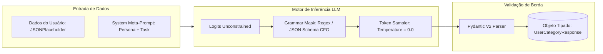
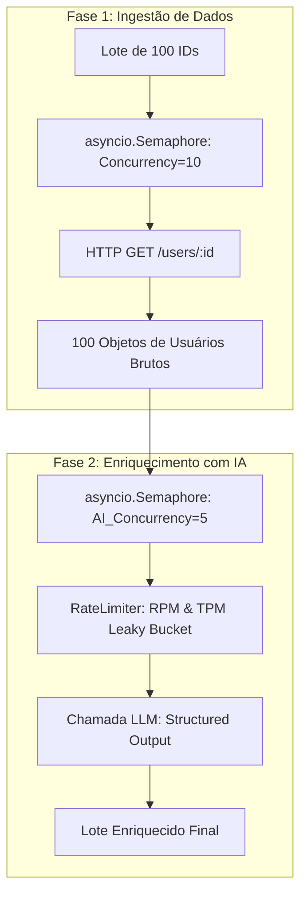

# 06. IA APLICADA EM PRODUÇÃO E PADRÕES AVANÇADOS DE ENGENHARIA DE PROMPTS

Este documento especifica os padrões de arquitetura de software e engenharia de inteligência artificial necessários para integrar modelos de linguagem de grande porte (LLMs) ao pipeline de processamento de usuários do **Hit Digital - Async User Batch Fetcher**.

---

## 1. O Desafio do Não-Determinismo em Sistemas Transacionais

Sistemas corporativos exigem invariantes estritas: tipos de dados previsíveis, campos obrigatórios preenchidos e garantias formais de contrato JSON. Por outro lado, LLMs (como GPT-4o, Claude 3.5 Sonnet ou Gemini 1.5 Pro) são motores probabilísticos auto-regressivos que amostram o próximo token com base em distribuições de probabilidade condicionais:

$$P(w_t \mid w_1, w_2, \dots, w_{t-1})$$

A tentativa ingênua de instruir o modelo via prompt livre ("*Por favor, responda apenas em formato JSON válido com os campos X e Y*") falha catastroficamente em produção devido a:
1. **Alucinações de Sintaxe:** Inclusão de blocos Markdown (```json ... ```), texto introdutório conversational ("Aqui está o seu JSON:") ou vírgulas extras (*trailing commas*).
2. **Deriva de Schema (Schema Drift):** Omissão de campos obrigatórios, renomeação de chaves (ex.: `user_id` virando `userId` ou `id`) e tipos incorretos (inteiro vindo como string).
3. **Injeção Indireta de Prompt:** Dados não sanitizados do usuário contendo comandos maliciosos que subvertem as instruções do sistema.

---

## 2. Structured Outputs: Amostragem Restrita por Gramática (CFG)

Para transformar a LLM em um componente transacional determinístico, o sistema adota o paradigma de **Structured Outputs** nativo com esquemas Pydantic.



### 2.1 Mecanismo de Funcionamento: Como o Modelo É Forçado a Não Errar

Diferente de filtros pós-geração, ferramentas modernas como **OpenAI Structured Outputs**, **Instructor** e **Outlines** atuam diretamente no momento em que os *logits* (distribuição bruta de probabilidades de tokens) são calculados pela rede neural:

1. O schema Pydantic é compilado em uma **Gramática Livre de Contexto (Context-Free Grammar - CFG)** ou em um Autômato Finito Determinístico (DFA).
2. A cada passo de amostragem de token, uma máscara booleana é aplicada sobre o vocabulário da LLM:
* Tokens que violariam a sintaxe JSON ou as chaves do schema recebem probabilidade zero ($-\infty$).
* Apenas tokens válidos de acordo com o estado atual da gramática permanecem com probabilidade elegível.


3. **Resultado Matemático:** É matematicamente impossível para o modelo emitir um JSON sintaticamente inválido ou um campo inexistente.

### 2.2 Exemplo de Implementação com Pydantic e Instructor

```python
from typing import List, Literal
from pydantic import BaseModel, Field
import instructor
from openai import AsyncOpenAI

# 1. Definição do Contrato Estrito de Saída da IA
class UserBusinessClassification(BaseModel):
    user_id: int = Field(..., description="ID do usuário analisado")
    market_segment: Literal["B2B Enterprise", "SMB", "B2C Consumer", "Gov / Education"] = Field(
        ..., description="Segmento de mercado deduzido a partir da empresa e domínio de e-mail"
    )
    engagement_priority: Literal["HIGH", "MEDIUM", "LOW"] = Field(
        ..., description="Prioridade de contato comercial"
    )
    risk_score: float = Field(
        ..., ge=0.0, le=1.0, description="Score de risco de fraude de 0.0 a 1.0"
    )
    reasoning_summary: str = Field(
        ..., max_length=200, description="Justificativa concisa da classificação"
    )

# 2. Cliente com Patch do Instructor para Injeção de CFG
ai_client = instructor.from_openai(AsyncOpenAI())

async def classify_user_with_ai(user_data: dict) -> UserBusinessClassification:
    return await ai_client.chat.completions.create(
        model="gpt-4o-mini",
        response_model=UserBusinessClassification,
        temperature=0.0, # Determinismo máximo
        messages=[
            {
                "role": "system",
                "content": (
                    "Você é um classificador especialista de dados cadastrais da Hit Digital. "
                    "Analise os dados fornecidos e produza a classificação categórica estrita."
                ),
            },
            {
                "role": "user",
                "content": f"Dados do Usuário: {user_data}",
            },
        ],
    )

```

---

## 3. Arquitetura de Resiliência para LLMs em Produção

### 3.1 Loop de Autocorreção em Tempo de Execução (Self-Correction / Reflection Loop)

Mesmo com restrições gramaticais, validações semânticas profundas (ex.: validações cruzadas com `@model_validator`) podem falhar em tempo de execução. Em vez de abortar o fluxo, implementa-se um loop de reflexão automática com limite máximo de retentativas:

```text
[Chamada à LLM] 
       |
       v
[Validação Pydantic V2]
       |
       +---> Válido? ------> [Retorna Modelo Tipado]
       |
       v (Inválido - ValidationError)
[Injeta Mensagem no Turno Seguinte]:
"O JSON anterior falhou na validação de regras de negócio com o seguinte erro:
{e.errors()}. Corrija os valores preservando os tipos."
       |
       v
[Segunda Chamada à LLM com Contexto do Erro (Attempt 2/3)]

```

```python
async def resilient_llm_execution(user_data: dict, max_retries: int = 2) -> UserBusinessClassification:
    messages = [
        {"role": "system", "content": "Classificador cadastral corporativo."},
        {"role": "user", "content": f"Dados: {user_data}"}
    ]
    
    for attempt in range(max_retries + 1):
        try:
            response = await ai_client.chat.completions.create(
                model="gpt-4o-mini",
                response_model=UserBusinessClassification,
                temperature=0.0,
                messages=messages,
            )
            return response
        except Exception as exc:
            if attempt == max_retries:
                # Fallback de emergência (Heurística sem IA)
                logger.error("llm_classification_exhausted_fallback", error=str(exc))
                return fallback_heuristic_classifier(user_data)
            
            # Adiciona o erro ao histórico da conversa para autocorreção
            messages.append({"role": "assistant", "content": "{"error": "failed_validation"}"})
            messages.append({"role": "user", "content": f"Erro de validação: {str(exc)}. Corrija o payload."})

```

### 3.2 Estratégia de Fallback Gracioso com Modelos Locais (SLMs)

Se a API do provedor de IA (OpenAI/Anthropic) sofrer uma indisponibilidade global (`HTTP 503 Service Unavailable` ou Rate Limits persistentes):

1. **Fallback L1 (Parser Tolerante):** Utilização da biblioteca `json-repair` para sanitizar saídas corrompidas de modelos mais rápidos.
2. **Fallback L2 (Roteamento para SLM Local):** Comutação automática de tráfego para um modelo local menor (Small Language Model - ex.: Llama-3-8B ou Mistral-7B via vLLM ou Ollama local) hospedado em infraestrutura própria da Hit Digital.
3. **Fallback L3 (Heurística Determinística):** Classificação baseada em regras estáticas (Regex no domínio do e-mail: `.edu` $\rightarrow$ Gov/Education, `.com` $\rightarrow$ B2B Enterprise).

---

## 4. Pipeline de Enriquecimento de Dados em Lote com Duplo Semáforo

Quando o `UserFetchService` processa um lote de 100 usuários e precisa enriquecê-los simultaneamente com inteligência artificial, surge um conflito de cotas:

* A API externa (JSONPlaceholder) tem limites de requisições por segundo (**RPS**).
* A API de LLM tem limites de requisições por minuto (**RPM**) e tokens por minuto (**TPM**).

### 4.1 Arquitetura de Duplo Semáforo Assíncrono



### 4.2 Código de Orquestração com Duplo Semáforo

```python
class EnrichedUserFetchService:
    def __init__(self, provider: BaseUserProvider, http_concurrency: int = 10, ai_concurrency: int = 5):
        self.provider = provider
        self.http_semaphore = asyncio.Semaphore(http_concurrency)
        self.ai_semaphore = asyncio.Semaphore(ai_concurrency)

    async def fetch_and_enrich_user(self, user_id: int):
        # 1. Busca do dado com Semáforo de Rede
        async with self.http_semaphore:
            user_data = await self.provider.fetch_user_by_id(user_id)

        # 2. Enriquecimento com IA com Semáforo de Cota de Tokens
        async with self.ai_semaphore:
            ai_classification = await classify_user_with_ai(user_data)

        # 3. Fusão dos Dados (Data Fusion)
        return {
            **user_data,
            "classification": ai_classification.model_dump(),
        }

```

Esta arquitetura garante que a saturação da cota de inteligência artificial jamais bloqueie ou interfira na vazão do pool de conexões HTTP da camada de dados principal.

---
